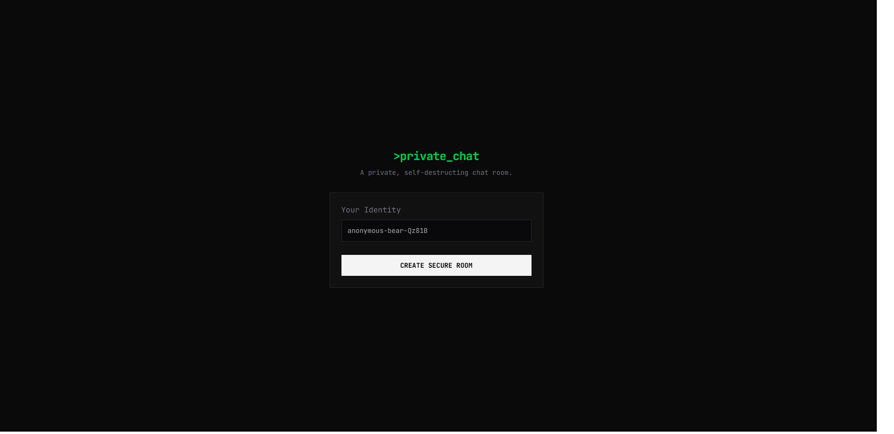

<h1>💬 Realtime Chat</h1>

<h2>About the Project</h2>
I built a secure real-time chat application using Next.js, TailwindCSS, ElysiaJS (end-to-end type-safe framework), Redis, and Upstash.   It allows users to create private chats that self-destruct after a set period, ensuring privacy and security. Token-based authentication ensures that no unauthorized user can access chat data.
<h2>Features</h2>
<ol>
  <li>Real-time messaging using Upstash Realtime</li>
  <li>Private chats with automatic self-destruction</li>
  <li>Temporary chat storage in Redis with serverless Upstash</li>
  <li>Responsive UI with TailwindCSS</li>
</ol>

<h2>Key learnings</h2>
<ol>
  <li>Implemented end-to-end type safety with TypeScript and ElysiaJS</li>
  <li>Developed real-time data handling using Redis hashes and Upstash channels</li>
  <li>Managed data fetching and mutations with TanStack Query</li>
</ol>

<h2>Live Preview</h2>
<a href="https://realtime-chat-pi-drab.vercel.app" target="_blank">Realtime Chat</a>

